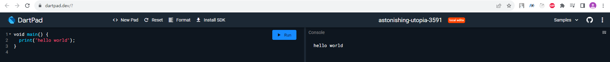
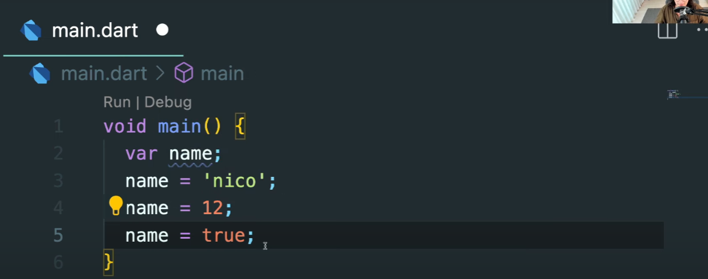
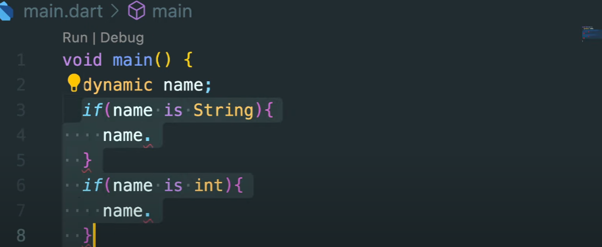
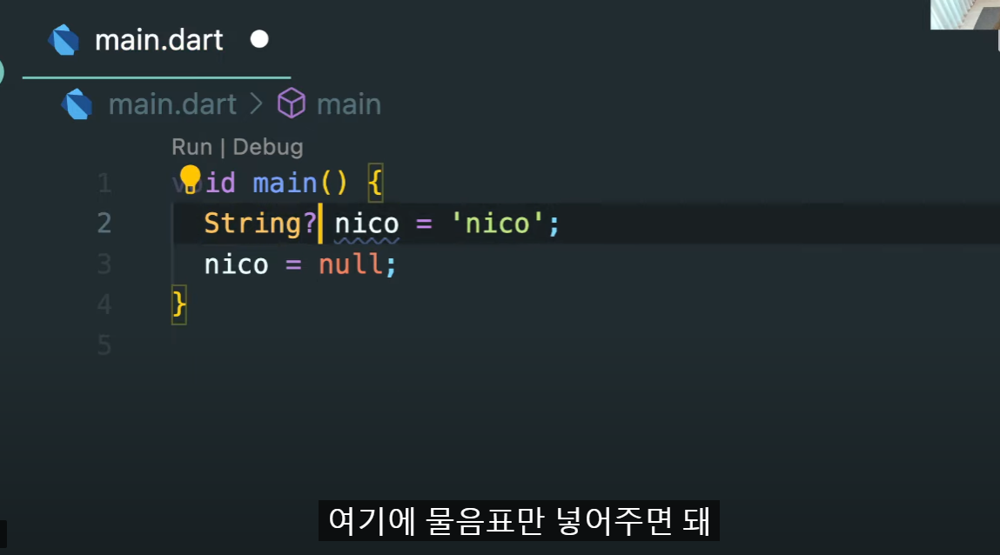
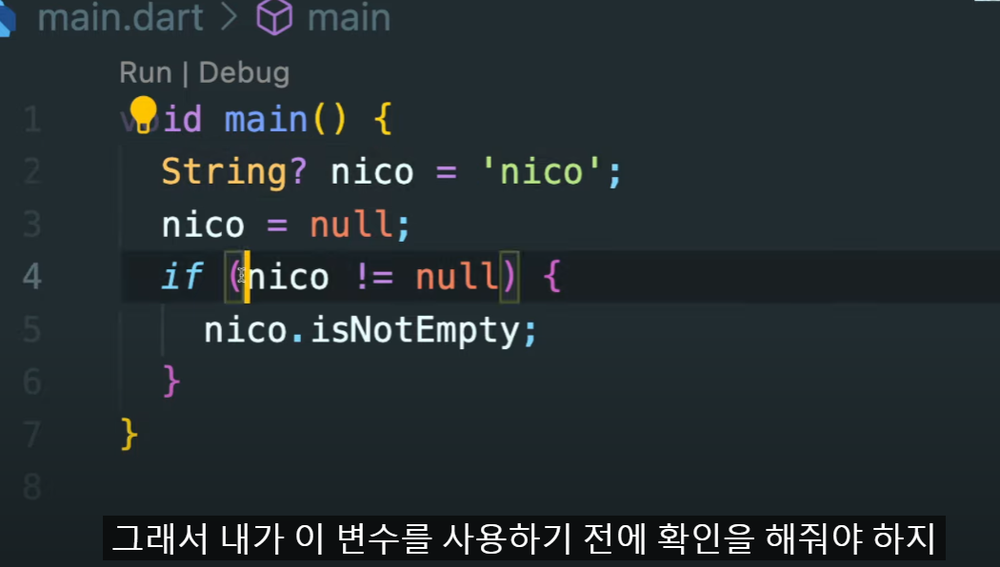

DartPractice start

## Dart

Dart의 컴파일러 기술을 사용하면 다양한 방식으로 코드를 실행할 수 있습니다.

기본 플랫폼: 모바일 및 데스크톱 장치를 대상으로 하는 앱의 경우 Dart에는 JIT(Just-In-Time) 컴파일 기능이 있는 Dart VM과 기계 코드 생성을 위한 AOT(Ahead-of-Time) 컴파일러가 모두 포함되어 있습니다.

웹 플랫폼: 웹을 대상으로 하는 앱의 경우 Dart는 개발 또는 프로덕션 목적으로 컴파일할 수 있습니다. 웹 컴파일러는 Dart를 JavaScript로 변환합니다.

https://dart.dev/overview

## How To Learn 

https://dartpad.dev << 들어가서 하거나



- VSCode 사용시 flutter extension 깔아보기

  -  vscode에서 하려고 flutter 설치하셨는데 sdk 설치하라고 안내문 

    vscode 관리자 권한으로 들어가셔서, 터미널에

    Set-ExecutionPolicy Bypass -Scope Process -Force; [System.Net.ServicePointManager]::SecurityProtocol = [System.Net.ServicePointManager]::SecurityProtocol -bor 3072; iex ((New-Object System.Net.WebClient).DownloadString('https://community.chocolatey.org/install.ps1'))

    ↑↑ 이거 입력 후

    choco install dart-sdk

    ↑↑ 이거 입력

    ** 설치할때 bash에서 말고 그냥 powershell터미널에서 하니까 됨


## 변수

변수를 만드는 2가지 방법

\```
void main() {
var name = "pizza"; // 방법 1
String name = "chicken"; // 방법 2
name = "chicken ";
}
\```
함수나 메소드 내부에 지역변수를 선언할 때는 var를 사용하고
class에서 변수나 property를 선언할 때는 타입을 지정해준다.

### Dynamic Type



- Dynamic 타입

  여러가지 타입을 가질 수 있는 변수에 쓰는 키워드이다. (해당 변수의 타입을 알 수 없을 때 주로 사용)
  변수를 선언할 때 dynamic을 쓰거나 값을 지정하지 않으면 dynamic 타입을 가진다

  꼭 써야할때만 써야한다

  ```dart
  void main(){
      dynamic name;
      var name2;
  }
  ```

  

  - 조건문으로 다양하게 활용가능하다
  - int면 dart에서는 홀수, 짝수 이런것들도 메서드로 제공

### Nullable Variable

- 개발자가 null 값을 참조할 수 없도록 하는 것이다.
  String뒤에 ?를 붙여줌으로서 name이 String 또는 null이 될 수 있다고 명시해준 것입니다.
  기본적으로 모든 변수는 non-nullable(null이 될 수 없음)이다.



- null값이든 string값이든 할때는 물음표




- 위에껄 단축한 문법
- 즉, nico가 null이 아니면 inNotEmpty 속성을 달라고 요청

### Final  Variables

- var대신 final로 변수를 만들게 되면 이 변수는 수정할 수 없게 된다.
  자바스크립트의 const랑 비슷하다.

### Late Variables

- 초기 데이터 없이 먼저 변수를 생성하고 추후에 데이터를 넣을 때 주로 사용한다.
  flutter로 data fecthing을 할 때 유용하다.
  late 변수를 만들고, API에 요청을 보낸 뒤에 API에서 값을 보내주면 그 응답값을 late변수에 넣어 사용할 수 있다.

```dart
void main() {
late final String name;

print(name); // name 변수에 접근 불가
}
```

### Constant Variables

- dart에서 const는 compile-time constant를 만들어준다.
  const는 컴파일할 때 알고 있는 값을 사용해야 한다.
  만약 어떤 값인지 모르고, 그 값이 API로부터 오거나 사용자가 화면에서 입력해야 하는 값이라면 그건 const가 아닌 final이나 var가 되어야 한다.
- const: 컴파일 시점에 바뀌지 않는 값 (상수)
  final: 컴파일 시점에 바뀌는 값 (API에서 받아온 값, 사용자 입력값)

## 데이터타입

### 기본

- 아래 타입을 포함한 거의 대부분의 타입들이 객체로 이루어져 있다. (함수도 객체)
  이것이 Dart가 진정한 객체 지향 언어로 불리는 이유.

  ```DART
  void main() {
      String name = "tom";
      bool isPlay = true;
      int age = 10;
      double money = 52.55;
      num x = 12;
      num y = 1.2;
  }
  ```

### Lists

- List 선언 두가지

  ```dart
  void main(){
      int case1 = [1,2,3,4,5];
      List case2 = [1,2,3,4,5];
  }
  ```

- dart는 `collection if`와 `collection for`을 지원

  ```dart
  void main(){
      var giveMeSix = true;
      int case1 = [
      1,
      2,
      3,
      4,
      5,
      if(giveMeSix) 6, // 이런 문법이 가능
  ];
  ```

  

### String Interpolation

- 변수 사용법

- $달러 기호를 붙이고 사용할 변수를 적어주면 된다.
  만약 무언가를 계산하고 싶다면 ${ } 형태로 적어주면 된다.

  ```dart
  void main(){
      var name = "tom";
      var age = 10;
      var greeting = "hello $name, I'm ${age + 5}";
  }
  ```

  

### Collection For

- Dart는 조건문(if) 및 반복(for)을 사용하여 컬렉션을 구축하는 데 사용할 수 있는 컬렉션 if 및 컬렉션 for도 제공

  ```dart
  void main() {
      var oldFriends = ["nico", "lynn"];
      var newFriends = [
      "tom",
      "jon",
      for (var friend in oldFriends) "❤️ $friend"
      ];
  
      print(newFriends); // [tom, jon, ❤️ nico, ❤️ lynn]
  }
  ```

  

### Maps

- Dart에서 Object는 TypeScripts의 any와 같다

- 맵은 key와 value를 연결하는 객체

  ```dart
  var gifts = {
      // Key: Value
      'first': 'partridge',
      'second': 'turtledoves',
      'fifth': 'golden rings'
      };
  
      // Map 생성자를 사용하여 동일한 객체를 만들 수 있음
      var gifts2 = Map();
      gifts2['first'] = 'partridge';
      gifts2['second'] = 'turtledoves';
      gifts2['fifth'] = 'golden rings';
  }
  // 이런식으로 타입지정해서 만들수도있음
  Map<String, bool> players = {
      "han": true,
      "sang": false,
  }
  ```

  

### Sets

- 파이썬의 Set과 같다
- 모든 요소가 유니크하다

## Functions

### 정의

```dart
String hello(String name) {
  return "hello $name zz";
}
String hello2(String name) => "hello $name zz";
// 한줄짜리는 이렇게 축약가능
```

### Named Parameters

- {} 중괄호안에 넣어준다

- 두가지 방법 존재

- 기본값을 제공하거나 required를 달거나

  ```dart
  // 기본값 제공시에는 함수 인자 없어도 기본값으로 대체
  String sayHello(
  {String name = "nico", 
   int age = 99, 
   String country = "Korea"}) {
  return "${name} / ${age} / ${country}";
  }
  
  // required 붙이면 함수 인자없이 호출하면 에러마크생김
  String sayHello(
  {required String name, 
   required int age, 
   required String country}) {
  return "${name} / ${age} / ${country}";
  }
  
  void main() {
      print(sayHello(name: "sugar", age: 10, country: "Korea"));
  }
  
  ```


### Optional Positional Parameters

```dart
String sayHello(String name, int age, [String? country = ""]
                // 여기가 중요 []안에 적으면서 ?와 default값
) {
	return 'Hello ${name}, You are ${age} from the ${country}';
}
```

### ?? 연산자

- 왼쪽 값이 null인지 체크해서 null이 아니면 왼쪽 값을 리턴하고 null이면 오른쪽 값을 리턴

  ```dart
  String capitalizeName(String? name) {
  	return name?.toUpperCase() ?? "han";
  }
  ```

  

- ??= 연산자를 이용하면 변수 안에 값이 null일 때를 체크해서 값을 할당해줄 수 있다

  ```dart
  void main() {
      String? name;
      name ??= "nico";
      name = null;
      name ??= "han";
      print(name); // han
  }
  ```

  

### TypeDef

- 자료형에 원하는 alias 별명을 붙일 수 있음

  ```dart
  typedef ListOfInts = List;
  
  ListOfInts reverseListOfNumbers(ListOfInts list) {
      var reversedList = list.reversed.toList();
      return reversedList;
  }
  ```

  

## Class

- dart 클래스에서 property를 선언할 때는 타입을 사용해서 정의

  ```dart
  class Player {
      final String name = 'jisoung';
      // final 붙이면 수정할 수 없게 된다
      final int age = 17;
      void sayName(){
      // class method안에서는 this를 쓰지 않는 것을 권장한다.
      print("Hi my name is $name")
      }
  }
  
  void main(){
      // new를 꼭 붙이지 않아도 된다.
      var player =Player();
  }
  ```

  

### Constructors

- dart에서 생성자(constructor) 함수는 클래스 이름과 같아야 한다

  ```dart
  class Player {
      // 이럴 때 late를 사용한다.
      late final String name;
      late final int age;
      // 클래스 이름과 같아야한다!
      Player(String name, int xp){
      this.name = name;
      this.xp = xp
      
      // late를 지우고 아래처럼 한줄로 바꿀수있따
      Player(this.name, this.age);
      }
  }
  
  void main(){
  // Player 클래스의 인스턴스 생성!
  var player = Player("jisoung", 1500);
      
  
  ```

  

### Named Constructor Parameters

- 위에 positional (클래스가 커지고 property가 많아지면 헷갈림) 말고 함수처럼 name으로

  ```dart
  class Player {
      final String name;
      int age;
      String description;
  
      Player({
          required this.name,
          required this.age,
          required this.description,
      });
  }
  void main(){
  // 한 눈에 볼 수 있다.
      var player = Player(
      name: "jisoung",
      age: 17,
      description: "Happy coding is end coding"
      }
  }
  ```

  

### Named Constructor

- 편의 문법이 존재.

  ```dart
  ✅ Named parameters
  // 일반적인 방법
  Player.createBlue({
      required String name,
      required int xp
      }) : this.name = name,
      this.xp = xp,
      this.team = 'blue';
  
  // 간소화된 방법(dart는 간소화된 방법을 추천)
  Player.createRed({
      required this.name,
      required this.xp,
      this.team = 'red',
      });
  
  void main() {
      var player = Player.createBlue(
      name: "nico",
      age: 21,
      );
  }
  
  ✅ positional parameters
  // 일반적인 방법
  Player.createRed(String name, int xp)
      : this.name = name,
      this.xp = xp,
      this.team = 'red';
  
  // 간소화된 방법
  Player.createRed(
      this.name,
      this.xp,
      [this.team = 'red']
      );
  
  void main() {
      var player = Player.createRed("nico", 21);
  }
  ```

  
